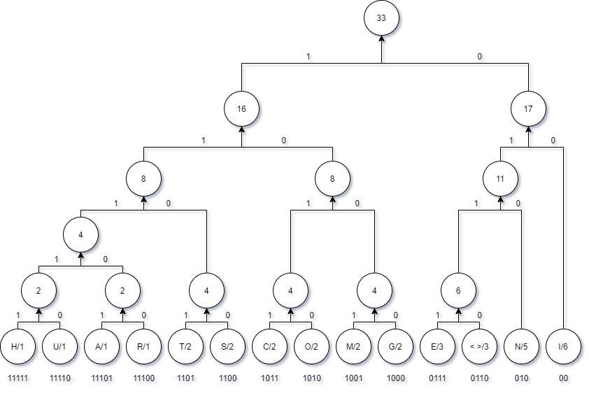

# Compression of Text using Huffman Coding

Refer the medium article for a better understanding: https://medium.com/@asavinda/c-program-for-text-compression-using-huffman-coding-6625d31d9e43?source=friends_link&sk=834b8706a7852100070b9000786fc010

This implementation has two seperate C programs. One will input a text file and will output a compressed version of the text file into two separate files. One is the **.huffman** file which has the content. The other file is **.table** file where it contains the huffman lookup table. The other program is used for decompression. This program inputs the above generated two **.huffman** file and **.table** file and will output a **.txt** file.

This method of coding was introduced by David A. Huffman  In 1951. while he was a Ph.D. student at MIT. He was given the task to find an efficient way of coding and came up with the idea of using a **frequency-sorted binary tree** and proved this method to be the most efficient. He published a paper in 1952 titled "[A Method for the Construction of Minimum Redundancy Codes](http://compression.ru/download/articles/huff/huffman_1952_minimum-redundancy-codes.pdf)".

## Huffman Tree and Coding using Huffman
Huffman tree is a technique that is used to generate codes that are distinct to each other. Using this method, most occurring symbols will get the least number of bits and others accordingly.
1. Sort all the different symbols and their particular frequency or probability. 
2. Take the two lowest probability symbol and create a new common node with the probability equal to the sum of the two probability. Always make sure to add the lowest summing up nodes. 
3. Add the new node to the table instead of the lowest two symbols or nodes. 
4. Repeat step two and three until one symbol or node is remaining. 
5. Then allocate ‘0’ to all the right branches and ‘1’ to all right branches
6. Read the bits from top of the tree to the bottom to each symbol and record their particular bit pattern 

### A Practical Example
Consider the following sentence.

**THIS IS COMMUNICATION ENGINEERING**

The following table represents the letters and their occurances in the above sentence.
|letter|no of occurences|letter|no of occurences|
|------|----------------|------|----------------|
|T     |2               |M     |2               |
|H     |1               |U     |1               |
|I     |6               |N     |5               |
|S     |2               |A     |1               |
|space |3               |E     |3               |
|C     |2               |G     |2               |
|O     |2               |R     |1               |

For the above table, consider the following huffman tree. Arrange all the letters in ascending order in their frequency of their occurance.


## How to Run the code
Compile both of the programs called huffman_encode.c and huffman_decode.c using GCC. 
```
gcc -o huffman_encode huffman_encode.c
gcc -o huffman_decode huffman_decode.c
```
After Compiling use the **huffman_encode** binary to encode or compress any given text file in **.txt** format. For example, if you input **abc.txt** file, this will output two separate files in the same directory with **abc.huffman** and **abc.table** extensions.
```
huffman_encode abc.txt
```
Use the **huffman_decode** binary to decode or decompress any **.huffman** and **.table** file. These two files are mandatory. The decoded file will be saved in a directory with extension **.decoded**
```
huffman_decode abc.huffman
```

